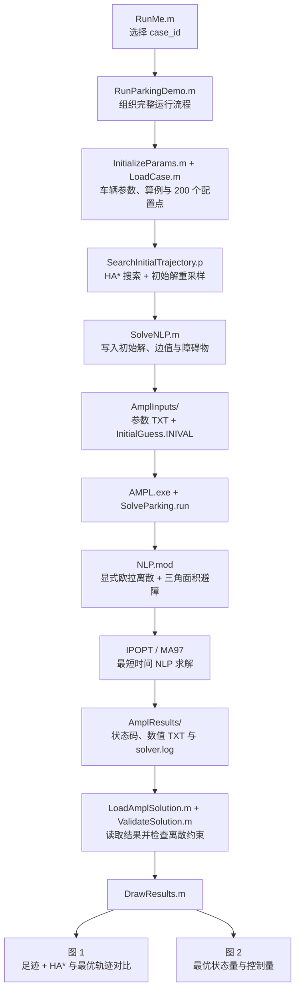

# KBS2015 · 第二章自主泊车轨迹规划配套代码

本仓库是**中文图书《非结构化场景自动驾驶轨迹规划技术》**第二章的配套代码。

- **中文书名**：《非结构化场景自动驾驶轨迹规划技术》
- **英文译名**：*Trajectory Planning Techniques for Autonomous Driving in Unstructured Environments*
- **对应章节**：第 2 章《面向狭窄泊车位场景的自主泊车轨迹规划基本方法》

**本书为中文图书。英文书名在此仅作为中文书名的译名，并非另一本英文版图书。** 建议结合本书第二章阅读本代码，了解车辆运动学、三角面积避障约束、最优控制问题的直接法离散与初始解构造。

This repository provides the Chapter 2 companion code for the **Chinese-language book** named above. The English title is a translation of the Chinese book title. Please read Chapter 2 for the mathematical formulation and numerical solution method, and cite the KBS 2015 paper below when using this code in research.

## 使用与引用

使用本代码开展研究时，**请在论文、技术报告等研究成果中引用以下论文**：

> Bai Li and Zhijiang Shao, “A unified motion planning method for parking an autonomous vehicle in the presence of irregularly placed obstacles,” *Knowledge-Based Systems*, vol. 86, pp. 11–20, 2015.

[DOI: 10.1016/j.knosys.2015.04.016](https://doi.org/10.1016/j.knosys.2015.04.016)

```bibtex
@article{LiShao2015Parking,
  author  = {Bai Li and Zhijiang Shao},
  title   = {A unified motion planning method for parking an autonomous vehicle in the presence of irregularly placed obstacles},
  journal = {Knowledge-Based Systems},
  volume  = {86},
  pages   = {11--20},
  year    = {2015},
  doi     = {10.1016/j.knosys.2015.04.016}
}
```

## 一键运行

运行环境：**Windows 64 位、MATLAB R2021b 或更新版本、Navigation Toolbox**。已在 MATLAB R2021b 下验证。请保留本目录中的 AMPL/IPOPT 可执行文件及配套 DLL。

1. 下载或克隆整个仓库，在 MATLAB 中打开仓库文件夹。
2. 打开 [RunMe.m](RunMe.m)，设置 `case_id` 为 `1`、`2`、`3`、`4` 中的一个。
3. 点击“运行”，等待求解并显示两张静态图。

```matlab
case_id = 4;                       % 1、2、3、4 四选一
result = RunParkingDemo(case_id);
```

默认第 4 例对应第二章图 2-4～图 2-7 的场景。也可在命令窗口直接调用 `result = RunParkingDemo(1)`。

**图 1**显示最优车身足迹、HA* 初始轨迹与优化后轨迹。先绘制足迹，再叠加两条轨迹，避免轨迹被足迹遮挡。**图 2**显示速度、前轮转角、朝向角、加速度、前轮转角速度，以及后轴中心位置的时间历程。

程序不生成视频、GIF 或自动保存图片。每次运行更新本程序的两张结果图，数值解保存在工作区的 `result` 中：

| 字段 | 含义 |
| --- | --- |
| `x`, `y`, `theta` | 后轴中心位置与车身朝向角，分别为 m、m、rad |
| `v`, `a` | 纵向速度与加速度，分别为 m/s、m/s² |
| `phy`, `w` | 前轮转角与转角速度，分别为 rad、rad/s |
| `terminal_time` | 最优终端时间，单位 s |
| `initial_guess` | HA* 路径构造的初始状态与控制量 |
| `solve_result_num` | AMPL 求解状态码 |
| `validation`, `timing`, `case_id` | 离散结果检查、计算耗时与算例编号 |

## 总体架构



MATLAB 通过命令行运行本目录的 `AMPL.exe SolveParking.run`。AMPL 加载模型与文本初值，调用 IPOPT 后将求解状态和数值解写回 TXT，MATLAB 再读取这些文件。**不需要配置 MATLAB 与 AMPL 的 API 接口，也不需要将求解器加入系统 PATH。** `SolveParking.run` 是 AMPL 命令文件。

## MATLAB 文件功能

### 入口、参数和算例

| 文件 | 功能 |
| --- | --- |
| [RunMe.m](RunMe.m) | 用户入口；给出图书说明与引用要求，设置 `case_id` 并运行演示。 |
| [RunParkingDemo.m](RunParkingDemo.m) | 定位代码目录，依次初始化、搜索、优化、检查和绘图，返回 `result`；结束时恢复调用前的工作目录。 |
| [InitializeParams.m](InitializeParams.m) | 设置车辆尺寸、状态/控制界限、HA* 搜索参数和 200 个配置点；准备交换目录并写出基本参数。 |
| [LoadCase.m](LoadCase.m) | 按 `case_id` 装载四个算例的起终位姿和障碍物顶点。 |

### 初始解与 AMPL 文件交互

| 文件 | 功能 |
| --- | --- |
| [FormInitialGuessViaFullConfig.m](FormInitialGuessViaFullConfig.m) | 将完整初始解写为 AMPL `let` 语句，并按车辆几何关系计算四角初值。 |
| [WriteBoundaryValues.m](WriteBoundaryValues.m) | 写出起终位置与朝向角；选取与初始解连续的等价角度分支。 |
| [WriteObs.m](WriteObs.m) | 将障碍物四个顶点写成 AMPL 可读取的索引数据。 |
| [SolveNLP.m](SolveNLP.m) | 组织输入文件，清除同名旧结果，调用 AMPL/IPOPT，保存求解日志，再读取数值解。 |
| [LoadAmplSolution.m](LoadAmplSolution.m) | 先读取求解状态，仅接受成功状态；检查结果文件是否齐全、数值是否有限、长度是否正确。 |
| [ValidateSolution.m](ValidateSolution.m) | 在配置点上核对显式欧拉方程、起终边值、变量界限与 `NLP.mod` 中的三角面积不等式。 |

### 静态绘图

| 文件 | 功能 |
| --- | --- |
| [DrawResults.m](DrawResults.m) | 生成两张结果图；先画最优足迹，再画 HA* 初始轨迹和最优轨迹，并绘制状态/控制量曲线。 |
| [DrawParkingScenario.m](DrawParkingScenario.m) | 在当前坐标轴绘制障碍物、网格及坐标标签。 |
| [DrawTrajFootprints.m](DrawTrajFootprints.m) | 沿最优轨迹的行驶距离选取代表性姿态，绘制车身矩形足迹。 |
| [CreateVehiclePolygon.m](CreateVehiclePolygon.m) | 根据后轴中心位置、朝向角和车身尺寸计算车身矩形边界，供静态绘图使用。 |

### 以 P-code 提供的初始化函数

这些函数仅提供 `.p` 文件，可直接由 MATLAB 调用，运行时不需要同名 `.m` 文件。

| 文件 | 功能 |
| --- | --- |
| `SearchInitialTrajectory.p` | 组织 HA* 搜索与初始解构造，将结果存入共享参数结构。 |
| `SearchHybridAStarPath.p` | 创建场景占据地图，调用 Navigation Toolbox 的混合 A*，输出位置与朝向角路径。 |
| `ResamplePath.p` | 根据前进/倒车分段构造速度初值，并重采样为与 NLP 配置点数量一致的完整初始解。 |
| `ParkingStateValidator.p` | 为工具箱中的 HA* 提供车辆姿态有效性判断。 |
| `IsVehiclePoseValid.p` | 执行 HA* 搜索内部使用的车身几何有效性判断。 |

P-code 用于提供初始化能力。第二章的 NLP 模型、文件交互及静态绘图代码保持可读；保护模块的明文源码不在本仓库中。

## 模型、求解器和数据目录

| 文件或目录 | 功能 |
| --- | --- |
| [NLP.mod](NLP.mod) | 自行车运动学的显式欧拉离散、四角几何关系、双向顶点三角面积不等式、边值与变量界限，目标为最小化终端时间。 |
| [SolveParking.run](SolveParking.run) | AMPL 命令入口；加载模型与初始解，调用 IPOPT，导出状态码和数值 TXT。 |
| [ipopt.opt](ipopt.opt) | IPOPT 的迭代、收敛精度及线性求解器配置，使用 MA97。 |
| `AMPL.exe`, `ipopt.exe`, `*.dll` | 配套的 Windows AMPL/IPOPT 运行文件及依赖库。 |
| `AmplInputs/` | 每次运行写入 `BasicParameters.txt`、`BoundaryValues.txt`、`ObstacleVertices.txt` 和 `InitialGuess.INIVAL`。 |
| `AmplResults/` | 保存状态/控制量 TXT、`terminal_time.txt`、`solve_result_num.txt`、`solve_result.txt` 及 `solver.log`。 |
| [.gitignore](.gitignore) | 排除运行数据、历史图片/视频及受保护函数的明文源码。 |

两个交换目录均保留 `.gitkeep`，保证空目录随仓库分发；运行时也会自动补建。每个数值 TXT 每行一个数。每次求解覆盖本程序的上一次数值输出，因此不要在同一文件夹同时运行多个算例。

求解状态失败或结果文件不完整时，程序停止并给出错误信息；可查看 `AmplResults/solver.log`，不会将上一次的结果误认为本次求解成功。

## 第二章实验参数

| 参数 | 设置 |
| --- | --- |
| 轴距 `Lw` | 2.800 m |
| 前悬 `Lf` | 0.960 m |
| 后悬 `Lr` | 0.929 m |
| 车宽 `Lb` | 1.942 m |
| 速度范围 | −1～1 m/s |
| 加速度范围 | −1～1 m/s² |
| 前轮转角范围 | −0.5～0.5 rad |
| 前轮转角速度范围 | −0.35～0.35 rad/s |
| 配置点数 | **200** |
| 目标函数 | 最小化 `T`，附加权重 `w1 = w2 = 0` |
| 求解器 | IPOPT，线性求解模块 MA97 |

配置点按作者要求统一为 **200**；其余表 2-1 中的车辆和目标函数参数保持一致。原程序中的三角面积余量保留为 0.01 m²。结果检查限于离散配置点，不增加配置点之间的插值碰撞验证。

本问题是非凸 NLP，初始解和离散点数变化后可能得到不同的局部最优数值。本演示不承诺逐点重现历史图中 `T = 21.2836 s` 的结果。

### 算例说明

- `case_id = 1, 2, 3, 4` 对应四组障碍布局；默认第 4 例用于第二章演示。
- 第 1 例的狭窄车位使用较细的 HA* 搜索分辨率，不改变 NLP 车辆参数与约束。
- 第 2 例的旧代码起点 `(-10, 3, 0)`、终点 `(1.8, 0, pi)` 在给定车身尺寸下与障碍物重叠。本演示保持障碍布局，显式修正为起点 `(-10, 3.4, 0)`、终点 `(1.5, 0, pi)`，并在 `LoadCase.m` 中注明；该例不是原始边值的原样数值复现。
- 默认第 4 例的起终位姿与障碍物沿用原文件设置。

## 已验证范围

在 Windows、MATLAB R2021b 与 Navigation Toolbox 环境下，四个算例均已使用 200 个配置点和 P-code 初始化模块完成运行，每例产生两张静态图。发布目录仅含 P-code 的受保护模块，不依赖其明文源码。
